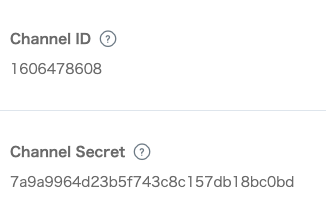
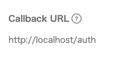

## LINE Login test

```
This sample code is for single user test.
NEVER USE IT WITHOUT MODIFICATION FOR YOUR PROJECT.
```

### 1. Get your channel id & channel secret for LINE login
* Open `https://developers.line.biz`
* Create channel, and get channel id & secret



* set redirect uri



### 2. Export environment variable
```
export CHANNEL_ID=<CHANNEL_ID>
export CHANNEL_SECRET=<CHANNEL_SECRET>
export REDIRECT_URI=<REDIRECT_URI>
```

### 3. Run example
```
$ go run examples/single/main.go
```

### 4. Open webpage
* http://localhost
